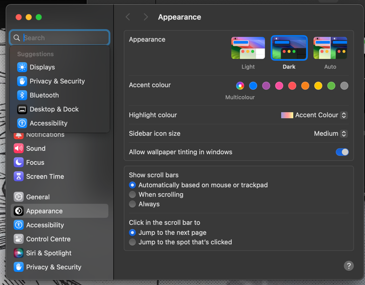
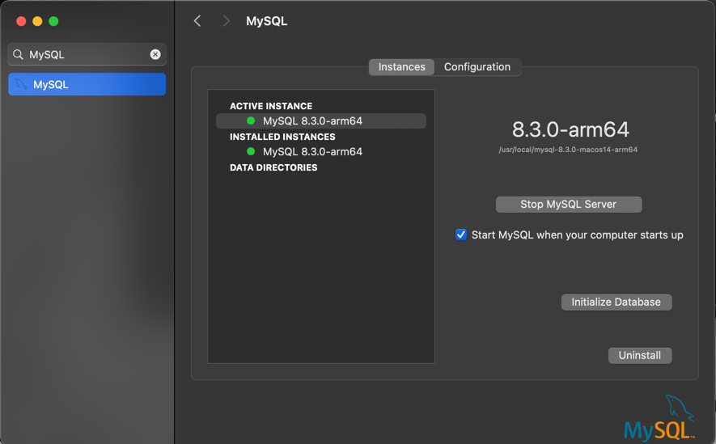

# Installing MySQL Server on macOS
Before installing MySQL server on macOS, let's make sure that we don't already have MySQL server installed on our device!

To check if MySQL is installed or not, follow the following steps:
1. Go to `System Settings`,
2. In the Search bar on the top-left, type `MySQL`

3. If you get the following on typing `MySQL`, then you already have `MySQL` server installed on your machine.

4. Otherwise, you don't have `MySQL` server installed on your machine, and you proceed with the following steps!
5. Go to `dev.mysql.com`, click on `MySQL Community Server` and ...